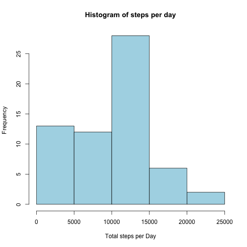
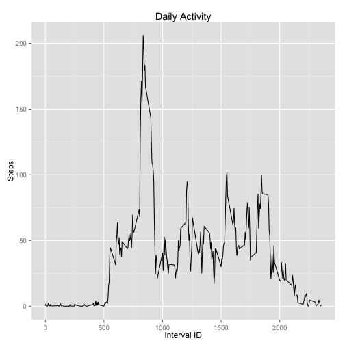
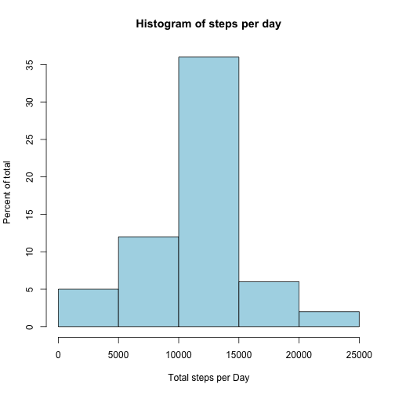
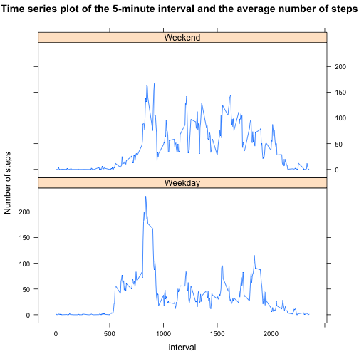

## Loading and Processing of data  


```r
setwd("~/Assignment1/")
activity <- read.csv("activity.csv",stringsAsFactors=FALSE)
activity$date <- as.POSIXct(activity$date, format="%Y-%m-%d")
library(ggplot2,suppressPackageStartupMessages)
library(lattice)
daily <- aggregate(activity['steps'], by=activity['date'], FUN='sum', na.rm=TRUE)
names(daily) <- c("date", "total_steps")
bySlice <- aggregate(activity['steps'], by=activity['interval'], FUN='mean', na.rm=TRUE)
names(bySlice) <- c("Interval_ID", "mean_steps")
```


## What is the mean total number of steps taken per day?  
Calculation of the mean and the median total numer of steps and drawing histogram

```r
mean_steps <- mean(daily$total_steps)
median_steps <- median(daily$total_steps)
options(scipen=1, digits=1)
hist(daily$total_steps, xlab="Total steps per Day", main="Histogram of steps per day",col="lightblue")
```

 

> The mean total number of steps = 9354.2  
The median total number of steps = 10395

## What is the average daily activity pattern?  
Calculation of the average daily activity pattern  


```r
ggplot(data=bySlice, aes(x=Interval_ID, y=mean_steps)) + geom_line() +
    xlab("Interval ID") + ylab("Steps") +
    ggtitle("Daily Activity")
```

 

```r
max_interval <- bySlice$Interval_ID[which.max(bySlice$mean_steps)]
```

> The 5-minute interval, on average across all the days in the dataset, which contains the maximum number of steps is interval 835

## Imputing missing values  
Calculating number of missing observations

```r
complete <- complete.cases(activity)
missing <- sum(! complete)
```
> The number of missing observation is 2304  

I will replace missing data with the average value of the time interval


```r
fixed <- activity
for (i in which(!complete)) {
  ti <- fixed[i,'interval']
  fixed[i,'steps'] <- bySlice[bySlice$Interval_ID == ti, 'mean_steps']
}
daily2 <- aggregate(fixed['steps'], by=fixed['date'], FUN='sum')
hist(daily2$steps, xlab="Total steps per Day",ylab="Percent of total", main="Histogram of steps per day",col="lightblue")
```

 

```r
meanDaily2 <- mean(daily2$steps)
medianDaily2 <- median(daily2$steps)
```
> The mean total number of steps taken per day = 10766.2, and median total number of steps taken per day =10766.2. These data are different from those calculated in the first part of the assignment. Imputing missing data reduced variability of data, the mean was chaned much more than the median.

## Are there differences in activity patterns between weekdays and weekends?
Creating a new factor variable in the dataset with two levels – “weekday” and “weekend” indicating whether a given date is a weekday or weekend day, and making a time series plot of the 5-minute interval and the average number of steps taken, averaged across all weekday days or weekend days.

```r
fixed$weekday <- factor(ifelse(weekdays(as.POSIXct(fixed$date)) %in% c("Saturday","Sunday"),"Weekend", "Weekday"))
byDay <- aggregate(fixed['steps'], by=c(fixed['interval'], fixed['weekday']), FUN='mean')
xyplot(byDay$steps ~ byDay$interval | byDay$weekday, type='l', xlab='interval',
       ylab='Number of steps',main="Time series plot of the 5-minute interval and the average number of steps", layout=c(1,2))
```

 


